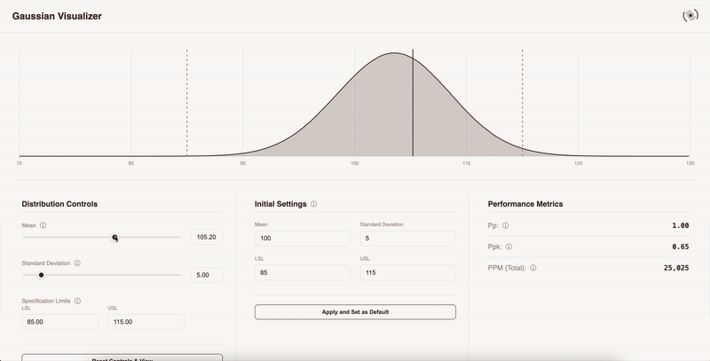

# 🌟 Portfolio: Gaussian Visualizer

> A lean portfolio showcasing the Gaussian Visualizer - an interactive tool for exploring normal distributions and statistical concepts.

## 🚀 Live Demo

Check out the live application: [Portfolio](https://your-portfolio-url.com)

## 📊 Featured Project: Gaussian Visualizer



The Gaussian Visualizer is an interactive educational tool for exploring normal (Gaussian) distributions and process capability metrics, ideal for students, engineers, and data enthusiasts.

**Key Features:**

- **Live Distribution Chart:**

  - Adjust the mean, standard deviation, and specification limits (LSL/USL) to see the normal curve update instantly.
  - Visualize the impact of changes on the shape and spread of the distribution.

- **Process Capability Metrics:**

  - Instantly calculate and display Pp, Ppk, and PPM (defects per million) as you adjust parameters.
  - See how process centering and spread affect capability indices.

- **Educational Tooltips:**

  - Hover over controls and metrics to get clear, concise explanations of statistical concepts.
  - Learn the formulas and significance of each metric in context.

- **Modern, Responsive UI:**
  - Built with React and TypeScript for a smooth, interactive experience.
  - Clean, professional design that works on all devices.

**Tech Stack:**

- React & TypeScript for robust component architecture
- Chart.js for high-performance data visualization
- SCSS for maintainable styling
- Vite for fast development and optimized builds

## 🛠️ Local Development

### Prerequisites

- Node.js (v18 or higher)
- npm or yarn

### Setup

```bash
# Clone the repository
git clone https://github.com/kbhatnagar97/Portfolio.git
cd Portfolio

# Install dependencies
npm install

# Start development server
npm run dev

# Build for production
npm run build
```

## 🔗 External Projects

**Habit Tracker:** For a comprehensive habit tracking application with advanced analytics, visit [habit-tracker.in](https://habit-tracker.in)

## 📄 License

This project is licensed under the MIT License - see the [LICENSE](LICENSE) file for details.
